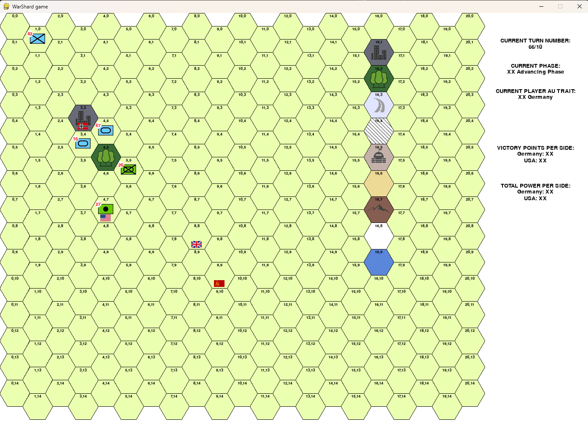

# WarShard
A simplified modern wargame designed to be compatible with training AIs, thanks to an API

NOT FUNCTIONAL YET

Based on SPI wargames.
Inspired by rules found at [spigames](https://www.spigames.net/rules_downloads.htm)

Rules are in 

API example in documentation in docs notebook

ADD A PRETTY SCREENSHOT HERE

## Installation

to install : in a terminal at the root of the project, run `pip install .`

## API

See api_example.ipynb notebook in the doc directory

General principle is that you should ask you AI agent to produce putative orders, then pass the list of those orders to the simulation
to see the results of those orders